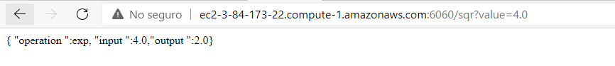

# Parcial2AREP-sqrt

Buen día profesor, el video se encuentra en mi otro repositorio de git. dejare el link [aquí](https://github.com/sebastianNietoMolina/parcialAREP2-lambdaEXP/blob/main/fotos%20y%20videos/Parcial2AREPSebastianNieto.mp4)
Esta sería la forma de hacer la petición si la maquina estuviera prendida, si desea probarlo me puede hacer la petición y la encenderé.

```
  http://ec2-3-84-173-22.compute-1.amazonaws.com:6060/sqr?value=4
```

Para poder usar esto, debes descargar la imagen en tu maquina ec2, o en tu repositorio local, para ello debes implementar el siguiente comando.

```
docker run -d -p 6060:6000 --name arepparcial2sqrt juanmol/parcial2arepsqrt
````
Al final si lo corrieron localmente deben ir.

```
localhot:6060/sqr?valuex
```

y ya, podrán ver algo como esto, en mi caso como lo subí en EC2, verán la url diferente.


